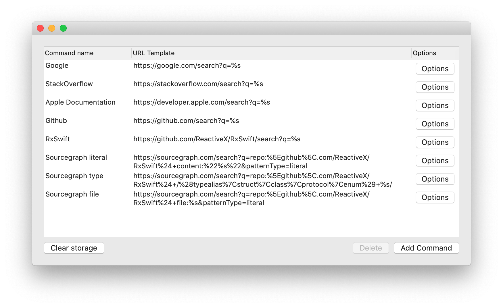
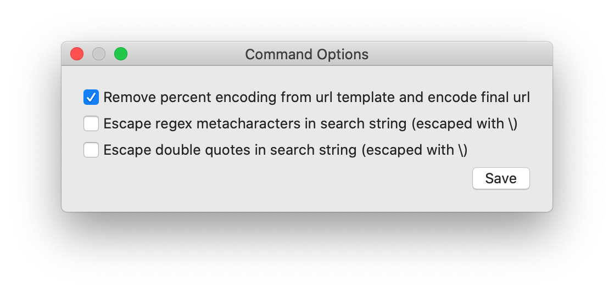

# XcodeUniversalSearch

Add shortcuts to search any url with selected text. This is like custom search engines for Google Chrome, for Xcode. We use it to quickly search Sourcegraph directly to link code to documentation and share with co-workers.

## Instructions

### Install

1. Download DMG from [Releases](https://github.com/sm11963/XcodeUniversalSearch/releases).
1. Open DMG.
1. Drag the app into the Applications directory.
1. Launch the app.
1. (optional) Add/remove search urls as desired, you can always do this later.
1. Open System Preferences > Extensions > Xcode Source Editor, make sure that UniversalSearch is enabled.
1. If open, quit Xcode.

### Use the extension

1. Launch Xcode.
1. Select some text in the editor (this must be on a single line right now).
1. Go to Menu bar > Editor > XcodeUniversalSearch (at the bottom) and select an option to open your defined URL with the selection.

### Editing configuration

1. Open XcodeUniversalSearch application.
1. Add/delete/update your search commands as necessary.
    - The Command name is what shows up in the Editor menu.
    - When the command is selected, the selected text is filled into the URL template replacing any `%s` tokens, the resulting URL is launched.
    - In Options, you can configure additional logic for constructing the URL, see [Options](#options) for more details.

#### Options

For each URL, there are some additional options to configure how to construct the URL to open.

##### Remove percent encoding from url template and encode final url

*Default enabled*

This configures if the full URL should be percent encoded before opening the URL. In order to be make it easier to copy and paste URLs, before percent encoding, this option will decode any existing percent encoded characters in the URL template. This should work most of the time, but there may be cases where this could cause some issues. If disabled, you will need to make sure that the URL template is appropriately percent encoded as a URL.

*Note*, the selected text will always be percent encoded regardless of this option - this option only affects the URL template.

##### Escape regex metacharacters in search string (escaped with /)

*Default disabled*

Enables escaping characters in the selection text that might match regex metacharacters. This is done using [NSRegularExpression.escapedPattern(for:)](https://developer.apple.com/documentation/foundation/nsregularexpression/1408386-escapedpattern), checkout those docs for an example of what this does.

This is useful if searching in a Sourcegraph regex pattern, typically your search from the selected text should be literal see the "Sourcegraph type" url template in [the screenshot](#xcodeuniversalsearch).

##### Escape double quotes in search string (escaped with /)

*Default disabled*

Enables escaping double quotes in the selection text.

This is useful if searching with a query which requires wrapping in double qoutes. For example, see "Sourcegraph literal" url template in [the screenshot](#xcodeuniversalsearch).

### Setup key bindings

1. Launch Xcode.
1. Open Xcode > Preferences > Key Bindings.
1. Search for "XcodeUniversalSearch".
1. Double click on the "Key" column next to the command for which to add a shortcut.
1. Press your chosen shortcut keys.
1. Click somewhere in the preferences pane, other than the "Key" column to save your key binding.
1. Make sure to check for conflicts with your shortcut (shown on the footer of the preference panel while setting shortcuts and also in the Conflicts tab).
1. Use your shortcut while editing.

#### Recommended shortcuts

| Command | Shortcut |
| --- | --- |
| Literal search for seletion | ⌥s (Option-s) |
| Search for Swift type with selected name | ⌥⇧S (Option-Shift-S) |
| Search for file with selected text | ⌥f (Option-f) |
