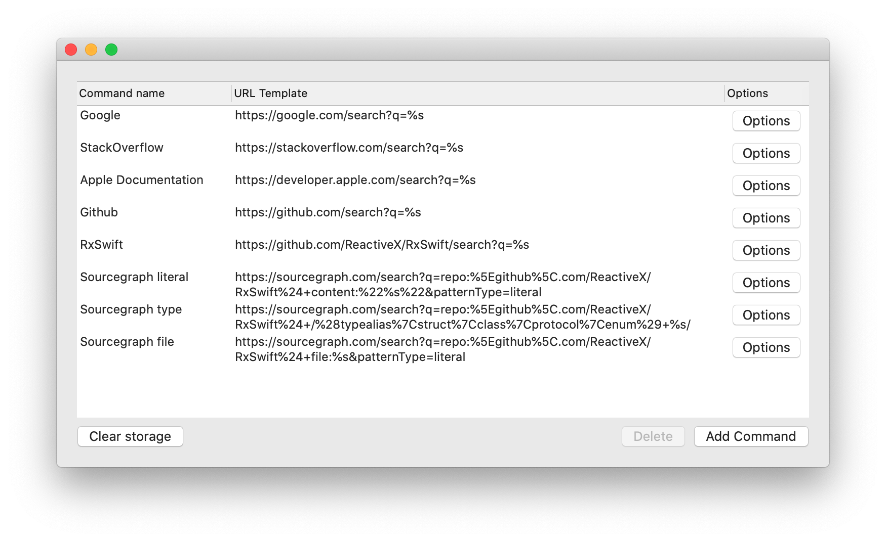

# XcodeUniversalSearch

## Instructions

### Install

1. Download DMG from [Releases](https://github.com/sm11963/XcodeUniversalSearch/releases).
1. Open DMG.
1. Drag the app into the Applications directory.
1. Launch the app.
1. (optional) Add/remove search urls as desired, you can always do this later.
1. Open System Preferences > Extensions > Xcode Source Editor, make sure that UniversalSearch is enabled.
1. If open, quit Xcode.

### Use the extension

1. Launch Xcode.
1. Select some text in the editor (this must be on a single line right now).
1. Go to Menu bar > Editor > XcodeUniversalSearch (at the bottom) and select an option to search for the selection.

### Editing configuration

1. Open XcodeUniversalSearch application.
1. Add/delete/update your search commands as necessary.
    - The Command name is what shows up in the Editor menu.
    - When the command is selected, the selected text is filled into the URL template replacing any `%s` tokens, the resulting URL is launched.
    - In Options, you can configure additional logic for escaping the text selection before filling in the URL - *note* these do not apply to the URL template
    - **Note** the entire url will be percent encoded, after adding any escape characters configured in the options to the selected text. So, if you add percent encoding to the url template, it will be double encoded.

### Setup keybindings

1. Launch Xcode.
1. Open Xcode > Preferences > Key Bindings.
1. Search for "XcodeUniversalSearch".
1. Double click on the "Key" column next to the command for which to add a shortcut.
1. Press your chosen shortcut keys.
1. Click somewhere in the preferences pane, other than the "Key" column to save your key binding.
1. Make sure to check for conflicts with your shortcut (shown on the footer of the preference panel while setting shortcuts and also in the Conflicts tab).
1. Use your shortcut while editing.

#### Recommended shortcuts

| Command | Shortcut |
| --- | --- |
| Literal search for seletion | ⌥s (Option-s) |
| Search for Swift type with selected name | ⌥⇧S (Option-Shift-S) |
| Search for file with selected text | ⌥f (Option-f) |
